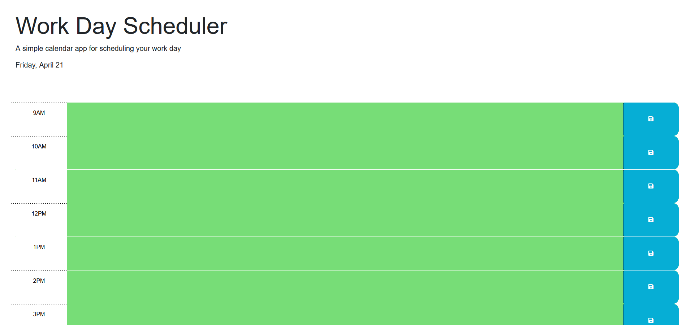

# Work Scheduler Challenge 5

## Description

This is a work scheduler that allows you to locally store different tasks during typical work hours. Throughout the course of the day, it updates the colors of the time slots based on the time.

## Installation

N/A

## Usage

To use this website, all you need to do is type in the task you would like to add for the specific hour, click the save button, and it will save it for further use. You can re-input anything as long as you click the save button again.

https://chickenchamp71.github.io/work-scheduler-challenge-5/

## Credits

N/A

## License

See license in repo.

